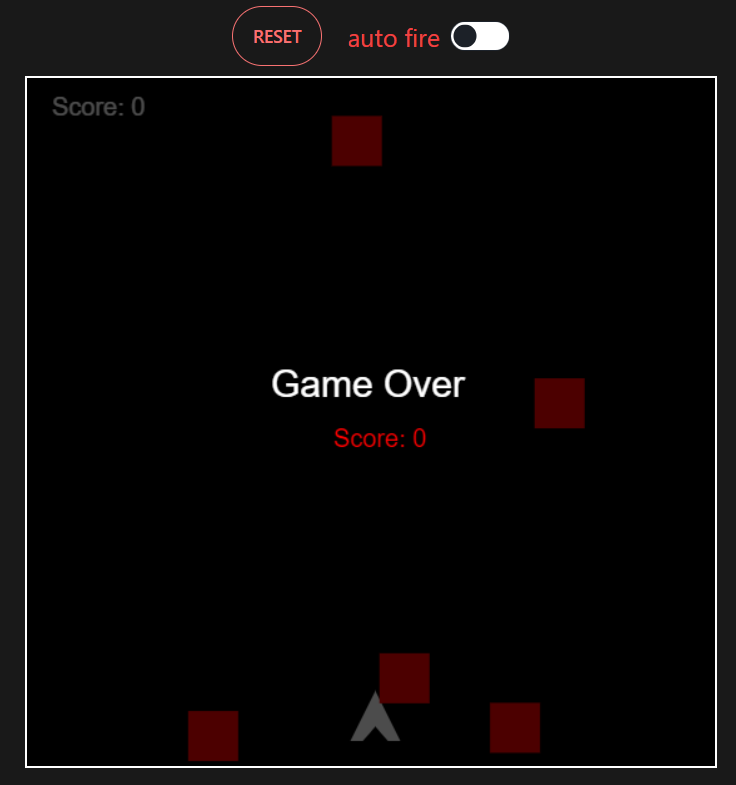

# Space_War
 
# Dark Space Canvas Game

Dark Space Canvas Game is a simple web-based space shooter game built using HTML5 canvas and JavaScript. In this game, you control a player spaceship and your mission is to shoot down enemy ships while avoiding collisions.

## Features

- Player spaceship controlled by mouse or touch input.
- Shooting mechanism to eliminate enemy ships.
- Auto-shoot feature (toggleable).
- Score tracking.
- Game over screen with the option to restart.
- Randomly spawning enemy ships.

## How to Play

- Move the player spaceship by moving your mouse or touching the screen.
- Click or touch to shoot bullets from your spaceship.
- Toggle the "Auto Shoot" checkbox to enable automatic shooting.
- Score points by hitting enemy ships.
- The game ends when a collision occurs between your spaceship and an enemy ship. You can restart the game by clicking the "Reset" button.

## Technologies Used

- HTML5 Canvas
- JavaScript

## Code Structure

The code is structured into several classes:

- `Player`: Represents the player spaceship.
- `ShootBall`: Represents the bullets shot by the player.
- `EnemyShip`: Represents the enemy ships.

The game loop is responsible for updating and rendering the game elements. Collision detection is performed to check for collisions between the player and enemy ships.

## How to Run

To run the game locally, follow these steps:

1. Clone this repository to your local machine.
2. Open the `index.html` file in a web browser.

## Preview

## License

This project is licensed under the MIT License - see the [LICENSE](LICENSE) file for details.
